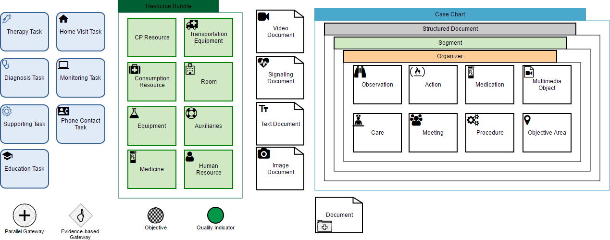

# bpmn-js-clinical-pathways
Dieses Projekt ist ein Modellierungseditor zur Abbildung von Konzepten Klinischer Pfade, die in die abstrakte Syntax des Metamodells der BPMN 2.0 integriert wurden.
Dieser Prototyp entstand während der Masterarbeit mit dem Titel `Konzeption & Implementierung eines webbasierten Modellierungseditors zur Abbildung Klinischer Pfad` von [`FÜSSLIN (2017)`](#literatur).
Die implementierten Konzepte stützen sich weitestgehend auf die Forschungsarbeiten von [`BRAUN ET AL. (2014)`](#literatur), [`BRAUN ET AL. (2015)`](#literatur), [`BRAUN ET AL. (2016)`](#literatur). 
Die vollständigen Literaturverweise können im Abschnitt [Literatur](#literatur) eingesehen werden.

Dabei wurde die JavaScript-Library **bpmn-js** als Ausgangsbasis herangezogen und an notwendigen Stellen erweitert.

## Vorstellung

### Modellierungseditor bpmn-js-clinical-pathways. Quelle: [`FÜSSLIN (2017), S. 49`](#literatur)


### Implementierte Konzepte Klinischer Pfade. Quelle: [`FÜSSLIN (2017), S. 56`](#literatur)


### DMN Beispiel. Quelle: [`FÜSSLIN (2017), S. 62`](#literatur)


## Voraussetzungen
Das Testsystem bestand aus folgenden Komponenten und wurde unter Windows 10 aufgesetzt:
* [Apache 2.4.23 (x64)](https://httpd.apache.org/)
* [PHP 7.1.0 (ZTS MSVC14 (Visual C++ 2015) x64)](http://php.net/)
* [NodeJS 7.2.0 & NPM 4.0.5](https://nodejs.org/)

**!Wichtig!**

Die Pfade der Programme `npm` und `php` müssen in der Windows PATH-Variable vorhanden sein, um Befehle über die Kommandozeile ausführen zu können.
Zum Beispiel:

Benutzervariable [PATH] für ###USERNAME###:
`C:\Users\###USERNAME###\scoop\apps\nodejs\7.2.0\nodejs`
 <br>
 Systemvariable [PATH]:
`C:\Users\###USERNAME###\scoop\apps\php\current`

(PHP unter Systemvariablen anlegen, da der WebServer meistens unter einem anderen User ausgeführt wird und daher die Systemvariablen des Nutzers ###USERNAME### keine Gültigkeit besitzen.)

## Struktur
### app
Dieser Ordner beinhaltet alle Quelldateien, um die bpmn-js erweitert wurde. Bpmn-js wurde nicht-destruktiv erweitert. Damit ist gemeint, dass die Quelldateien nicht modifiziert worden sind und die Library weiterhin gekapselt ist.
Das hat den Vorteil, dass bpmn-js unabhängig von diesem Projekt aktualisiert werden kann, um so von neuen Features und Bug-Fixes zu profitieren.
<br>Im Folgenden wird auf die einzelnen Unterordner kurz eingegangen.

#### clinical-pathways
In diesem Ordner sind die Erweiterungen gemäß des Ordner-Schemas von bpmn-js organisiert.

#### php
In diesem Verzeichnis befindet sich das Server-Backend auf Basis des Zend Framework 3. 
Für weitere Informationen zur Funktionsweise und Struktur des Zend Framework 3 sei auf dessen [Dokumentation](https://framework.zend.com/learn) verwiesen.


##### config/autoload/elFinder.global.php
 Diese Datei enthält die Konfiguration für das Dateibrowser-Modul **"ElFinder"**.
##### module/Application
 Das Application Modul. In diesem Modul befinden sich Controller und Views zur Anzeige und Konfiguration des Modellierungseditors und der Dateibrowserfunktionalität von **"ElFinder"**.
##### module/Application/module.config.php
 Diese Datei beinhaltet die Konfiguration des Moduls Application. Darin enthalten sind z. B. die Konfiguration des Routers, der festlegt, welche URLs von welchem Controller verarbeitet werden.
##### module/Application/src/Application/Controller
 Hier befinden sich die Controller, die für die Verarbeitung bestimmter URLs angelegt worden sind und passende Views bzw. JSON-Daten zurückliefern.
##### module/Application/view/layout/layout.phtml
 Diese Datei stellt das Grundgerüst des HTML-Layouts zur Verfügung.
##### module/Application/view/application/index
 In diesem Ordner befinden sich Views. **"index.phtml"** ist für die Anzeige des BPMN-Modellierungseditors zuständig, **"index-dmn"** für die Darstellung des DMN-Modellierungseditors.
##### public/cp-modeler
 In diesen Ordner werden beim Deployment-Prozess durch **"grunt"** alle für die Ausführung des Modellierungseditors notwendigen Dateien kopiert.
 
 **AUSNAHME: app/index.html** und **app/dmn/index.html!** Ergeben sich Änderungen im Projekt an diesen Dateien, müssen diese Änderungen momentan manuell
in den View-Scripts **"module/Application/view/application/index/index.phtml"** sowie **"module/Application/view/application/index/index-dmn.phtml"** nachgezogen werden!
Neue Scripts/Stylesheets, die in den Header geladen werden müssen, können auch in **module/Application/view/layout.phtml** angepasst werden.
##### public/workspace
 Hier befindet sich der workspace, in dem Dateien gespeichert und geladen werden können vom integrierten Dateibrowser **"ElFinder"**.
##### composer.json
 In dieser Datei werden die Abhängigkeiten des Zend Frameworks 3 vorgehalten.

## Ausführung
Im Folgenden wird erklärt, wie das Projekt in einer lokalen Testumgebung ausgeführt werden kann.

### Abhängigkeiten installieren
 ```
 npm install
 ```
### Ausführen des Projektes (ohne PHP Funktionalitäten)
 Der Befehl
 ```
 grunt auto-build
 ```
 kopiert alle notwendigen Dateien in den **"dist"** Ordner, führt den integrierten WebServer **Karma** aus und lädt das Projekt im Browser
 unter **http://localhost:9013**.
 
 ### Produktiv-Version erzeugen (inkl. PHP Funktionalitäten)
 Der Befehl
 ```
 grunt php-release
 ```
 kopiert alle notwendigen Dateien in den Ordner **php/public/cp-modeler** und stellt diese für die Verwendung innerhalb des integrierten Zend Framework 3 bereit.
 
## Literatur
[BRAUN ET AL. 2014] BRAUN, Richard ; SCHLIETER, Hannes ; BURWITZ, Martin ; ESSWEIN,
Werner: _Bpmn4cp: Design and implementation of a bpmn extension for clinical pathways._
In: Bioinformatics and Biomedicine (BIBM), 2014 IEEE International Conference on IEEE,
2014, S. 9–16

[BRAUN ET AL. 2015] BRAUN, R. ; BURWITZ, M. ; SCHLIETER, H. ; BENEDICT, M.: _Clinical
processes from various angles - amplifying BPMN for integrated hospital management._ In:
2015 IEEE International Conference on Bioinformatics and Biomedicine (BIBM), 2015, S.
837–845

[BRAUN ET AL. 2016] BRAUN, Richard ; SCHLIETER, Hannes ; BURWITZ, Martin ; ESSWEIN,
Werner: _BPMN4CP Revised – Extending BPMN for Multi-perspective Modeling of Clinical
Pathways._ In: Hawaii International Conference on System Sciences (HICSS) 49 (2016), S.
3249–3258. – DOI [http://doi.ieeecomputersociety.org/10.1109/HICSS.2016.407](http://doi.ieeecomputersociety.org/10.1109/HICSS.2016.407). – ISSN 1530–1605

[FÜSSLIN 2017] FÜSSLIN, Maximilian: _Konzeption & Implementierung eines webbasierten Modellierungseditors zur Abbildung Klinischer Pfade._ 2017. Technische Universität Dresden