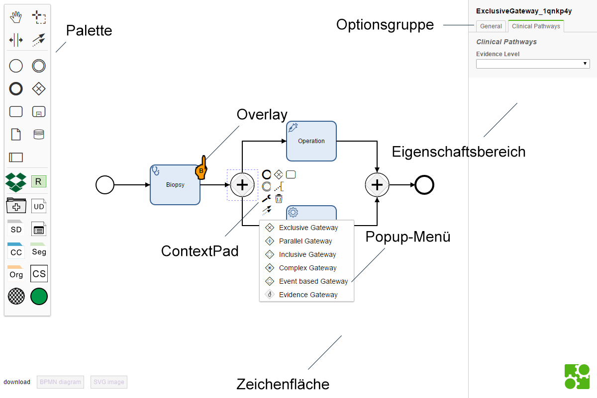

# app - Struktur und Erläuterungen der Komponenten
In dieser README wird auf die einzelnen Unterordner **./app/*** kurz eingegangen. Dazu ist folgende Abbildung hilfreich, um die verwendeten Fachbegriffe zuordnen zu können.

## Table of Contents

[Zurück zur Hauptseite](../../../)

- [app/clinical-pathways](#appclinical-pathways)
    - [context-pad/CPContextPadProvider.js](#context-padCPContextPadProvider)
    - [draw/CPRenderer.js](#drawcprenderer)
    - [ext-metamodel/CPMetamodel.json](#ext-metamodelcpmetamodeljson)
    - [import/CPImporter.js](#importcpimporter)
    - [modeling/behavior/CPLabelSupport.js](#modelingbehaviorcplabelsupport)
    - [palette/CPPaletteProvider.js](#palettecppaletteprovider)
    - [popup-menu/CPReplaceMenuProvider.js](#popup-menucpreplacemenuprovider)
    - [properties-provider/CPPropertiesProvider.js](#properties-providercppropertiesprovider)
    - [rules/CPRules.js](#rulescprules)
- [dmn](#dmn)
- [elFinder/elFinderHelper.js](#elfinderelfinderhelperjs)

## Modellierungseditor bpmn-js-clinical-pathways. Quelle: [`FÜSSLIN (2017), S. 49`](#literatur)


## [app/clinical-pathways](app/clinical-pathways)
In diesem Ordner befinden sich die Erweiterungen der Konzepte Klinischer Pfade, die in bpmn-js integriert wurden.

### [context-pad/CPContextPadProvider](clinical-pathways/context-pad/CPContextPadProvider.js)
In dieser Klasse wird das ContextPad für die integrierten Konzepte Klinischer Pfade erweitert. Dazu wird für jedes neue Element festglegt, welche Einträge im ContextPad zu finden sind.

### [draw/CPRenderer](clinical-pathways/draw/CPRenderer.js)
Diese Klasse kümmert sich um das Rendering der einzelnen Elemente. Es existiert dazu eine Variable _handlers_, die aus einem Array an "Element-Typ"-Funktionspaaren besteht. 
Wird das Rendering eines bestimmten Elements angefordert, wird in dieser Variable anhand des Element-Typs die passende Funktion zum Zeichnen des Elements aufgerufen:
```javascript
var handlers = this.handlers = {
    'cp:Task': function (parentGfx, element, attrs) {
        attrs = assign(attrs || {}, {
            fill: "#e1ebf7",
            stroke: "#376092"
        });

        var rect = drawRect(parentGfx, element.width, element.height, TASK_BORDER_RADIUS, attrs);
        renderEmbeddedLabel(parentGfx, element, 'center-middle');
        attachTaskMarkers(parentGfx, element);
        return rect;
    },
    'label': function (parentGfx, element) {
        // Update external label size and bounds during rendering when
        // we have the actual rendered bounds anyway.

        var textElement = renderExternalLabel(parentGfx, element);

        var textBBox;

        try {
            textBBox = textElement.getBBox();
        } catch (e) {
            textBBox = {width: 0, height: 0, x: 0};
        }

        // update element.x so that the layouted text is still
        // center alligned (newX = oldMidX - newWidth / 2)
        element.x = Math.ceil(element.x + element.width / 2) - Math.ceil((textBBox.width / 2));

        // take element width, height from actual bounds
        element.width = Math.ceil(textBBox.width);
        element.height = Math.ceil(textBBox.height);

        // compensate bounding box x
        svgAttr(textElement, {
            transform: 'translate(' + (-1 * textBBox.x) + ',0)'
        });

        return textElement;
    },
    'cp:TherapyTask': function (parent, element) {
        var task = renderer('cp:Task')(parent, element);
        var url = Icons.iconTherapyTask;

        var shapeGfx = svgCreate('image', {
            x: 3,
            y: 3,
            width: 20,
            href: url
        });

        svgAppend(parent, shapeGfx);

        return task;
    }
}
```

### [ext-metamodel/CPMetamodel.json](clinical-pathways/ext-metamodel/CPMetamodel.json)
In dieser Datei ist das erweiterte Metamodell der Konzepte Klinischer Pfade abgebildet. 

### [import/CPImporter.js](clinical-pathways/import/CPImporter.js)
Diese Datei stellt beim Laden eines Modells sicher, dass externe Labels an entsprechend konfigurierte Elemente angehangen werden.

### [modeling/behavior/CPLabelSupport.js](clinical-pathways/modeling/behavior/CPLabelSupport.js)
In dieser Datei wird zur Laufzeit ermittelt, welche Elemente externe Labels besitzen und diese dementsprechend gerendert.

### [palette/CPPaletteProvider.js](clinical-pathways/palette/CPPaletteProvider.js)
In dieser Klasse wird die Palette um Elemente Klinischer Pfade erweitert. Diese können fortan mittels gedrückter Maus auf die Zeichenfläche (bzw. in das bpmn:Process- / bpmn:Collaboration-Element) gezogen werden.

### [popup-menu/CPReplaceMenuProvider.js](clinical-pathways/popup-menu/CPReplaceMenuProvider.js)
In dieser Datei wird das Popup-Menü konfiguriert. Im Zusammenspiel mit der Datei [replace/CPReplaceOptions.js](clinical-pathways/replace/CPReplaceOptions.js) wird ermittelt, welche Einträge in das Popup-Menü integriert werden sollen.
Bspw. werden für ein Element bpmn:Task sinnvollerweise alle dessen Subtypen als Einträge festgelegt. So kann der Modellersteller die Typisierung eines bpmn:Task-Elements vornehmen.

### [properties-provider/CPPropertiesProvider.js](clinical-pathways/properties-provider/CPPropertiesProvider.js)
In dieser Klasse werden die Optionsgruppen konfiguriert. Dazu wird festgelegt, welche Tabs für ein markiertes Element integriert und welche Attribute modifiziert werden sollen können.
Für jedes Element bzw. Attribut wurden dazu Dateien im Ordner [properties-provider/parts](clinical-pathways/properties-provider/parts) angelegt, die das jeweilige Attribut entsprechend als Textfeld oder Auswahlliste rendern.

### [rules/CPRules.js](clinical-pathways/rules/CPRules.js)
In dieser Datei werden Modellierungsregeln formuliert. Dazu werden die Methoden `canCreate()` und `canConnect()` bei der Erstellung eines Elements ausgewertet. Will der Modellersteller ein Element bzw. Assoziation an einer Stelle platzieren, die aus sytaktischen Gründen nicht erlaubt ist, wird das betreffende Element rot hinterlegt.
Andernfalls wird durch eine grüne Hinterlegung eine valide Möglichkeit der Platzierung suggeriert.

## [dmn](dmn)
In diesem Ordner ist der integrierte DMN-Modellierungseditor enthalten (bzw. dessen Einspringspunkt). Dieser kann in der Datei [app.js](dmn/app.js) konfiguriert werden. Der DMN-Modellierungseditor kann über einen Link im Eigenschaftsfenster in der Optionsgruppe _Clinical Pathways_ eines Evidence-based Gateways aufgerufen werden.
Speichert der Modellersteller das aktuelle DMN-Modell, wird dessen XML an eine im Fenster des BPMN-Modellierungseditors geladenen Funktion `window.opener.notifyDMNSave(xml)` übergeben und dort in das BPMN-XML als CDATA-Element integriert.

## [elFinder/elFinderHelper.js](elFinder/ElFinderHelper.js)
Diese Datei stellt Funktionen für den integrierten Dateibrowser bereit. Dieser funktioniert nur, wenn die Anwendung auf einen WebServer mit PHP Funktionalität deployed wurde.
